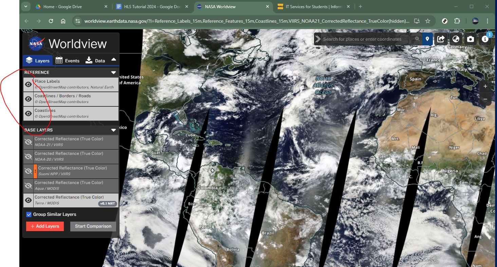
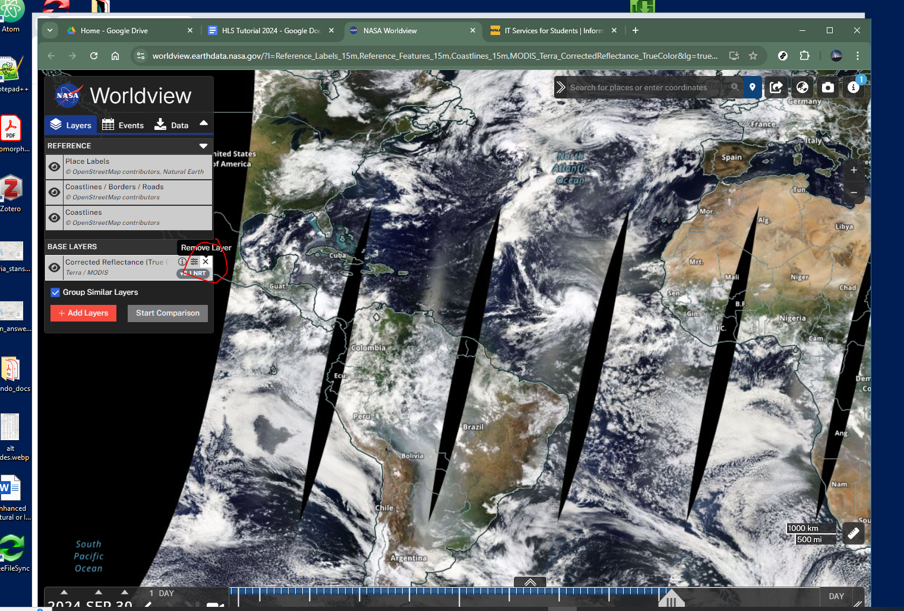
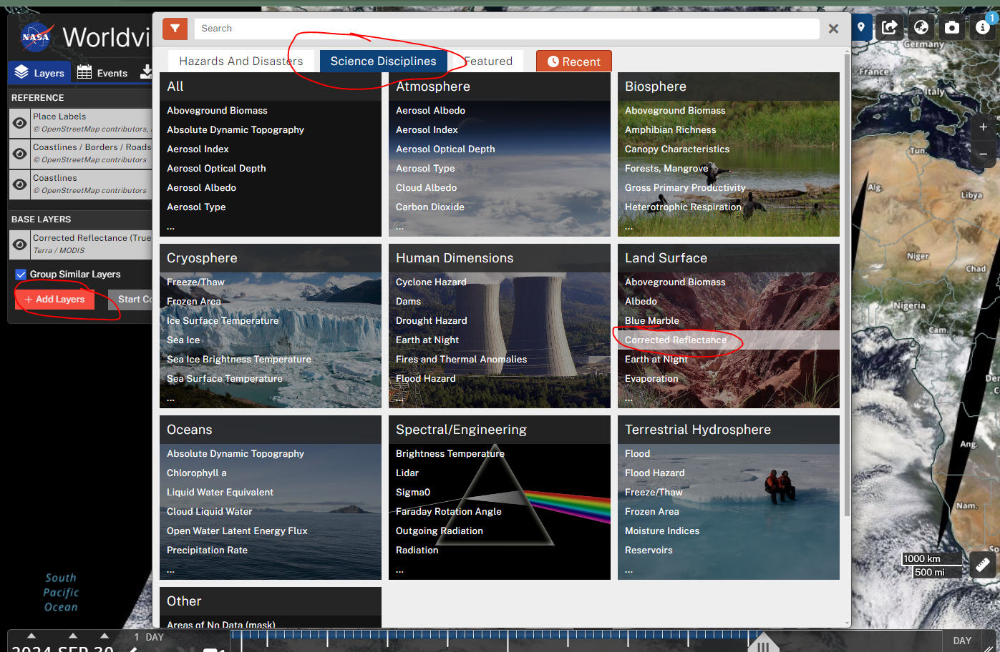
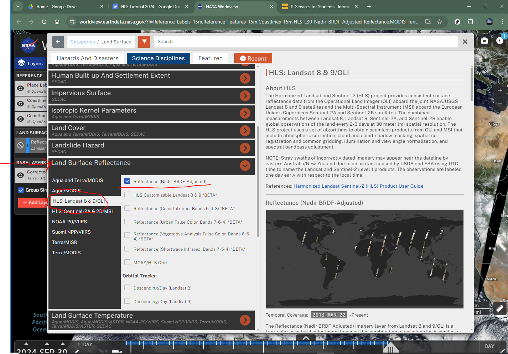
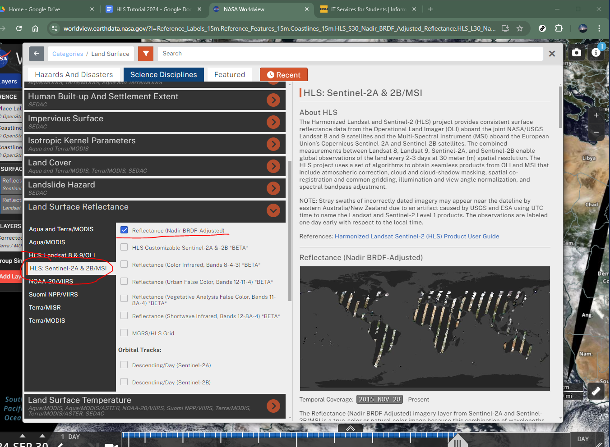

## Introduction 



## Timeline 

## Resources and Sources 

- [Data in Harmony: NASA's Harmonized Landsat and Sentinel-2 Project](https://www.youtube.com/watch?v=63ljR84c85M)

- [HLS Overview - NASA Earth Data - LPDAAC](https://lpdaac.usgs.gov/data/get-started-data/collection-overview/missions/harmonized-landsat-sentinel-2-hls-overview/)

- [Harmonized Landsat Sentinel-2 (HLS) Product User Guide](chrome-extension://efaidnbmnnnibpcajpcglclefindmkaj/https://lpdaac.usgs.gov/documents/1698/HLS_User_Guide_V2.pdf)

- [HLS Data Resources](https://lpdaac.usgs.gov/resources/e-learning/hls-data-resources/)

## Resources and Sources continued 

- [HLS Python Tutorial](https://github.com/nasa/HLS-Data-Resources/blob/main/python/tutorials/HLS_Tutorial.ipynb)

- [HLS R Tutorial](https://github.com/nasa/HLS-Data-Resources/blob/main/r/HLS_Tutorial.Rmd)

## Harmonized Landsat and Sentinel-2 (HLS) {.smaller}

- seamless surface reflectance records from the operational land imager (OLD) aboard Landsat 8/9 and the multi-spectral instrument (MSI) aboard sentinal 2A/B
- HLS Version 2.0 available with global coverage (except Antartica)
- 3-day return at equator, more frequent at higher latitutdes

The combined measurement enables global observations of the land every 2–3 days at 30 meter (m) spatial resolution. The HLSS30 and HLSL30 products are gridded to the same resolution and Military Grid Reference System (MGRS) tiling and are “stackable” for time series analysis. 

## HLS {.smaller}

**Advantages of HLS**

::::{.columns}

:::{.column width ="50%"}
::: {.incremental}
- Increased temporal frequency
- Common gridding
- Unified atmospheric correction
- Illumination & view angle normalization
- Spectral bandpass adjustment
:::
:::

:::{.column widght = "50%"}

:::
::::

## Potential Applications {.smaller}

::::{.columns}

:::{.column width ="50%"}
::: {.incremental}

- Active Fires
- Snow Extent
- Agriculture
- Inland flooding
- Urban Applications
- Disaster Alert - land change monitoring
:::
:::

:::{.column widght = "50%"}

:::
::::
## Naming Conventions{.smaller}

In this example of a swath product, the filename **HLS.S30.T60HTE.2022103T222539.v2.0.B01.tif** indicates:

::: {.incremental}
- **HLS.S30** – Product Short Name
- **T60HTE** – MGRS Tile ID (T+5-digits)
- **2022103** – Julian Date of Acquisition (YYYYDDD)
- **T222539**– Time of Acquisition (HHMMSS)
- **v2.0** – Collection Version
- **B01** – Spectral Band, Angle Band or QA(Fmask)
- **tif** – Data Format (Cloud Optimized GeoTiff)
:::

## Tiling System {.smaller}

The HLS tiling system is identical to the one used for Sentinel-2. The tiles’ dimensions are 109.8 km squares with an overlap of 4,900 m on each side. The system is aligned with the Military Grid Reference System (MGRS), and its naming convention is derived from the UTM (Universal Transverse Mercator) system. The UTM system divides the Earth’s surface into 60 vertical zones. Each UTM zone has a vertical width of 6° of longitude and horizontal width of 8° of latitude, as shown in the map below. Each UTM zone is subdivided into MGRS 110 x 110 km zones.

## HLS Data Processing 1 {.smaller}

::: {.incremental}
- HLS uses a processing chain involving several separate radiometric and geometric adjustments, with a goal of *eliminating differences* in retrieved *surface reflectance* arising solely from differences in instrumentation. 

- Input data products from Landsat 8/9 (Collection 2 Level 1T top-of-atmosphere reflectance or top-of-atmosphere apparent temperature) and Sentinel-2 (L1C top-of-atmosphere reflectance) are ingested for HLS processing.

- A series of *radiometric and geometric corrections are applied* to **convert data to surface reflectance**, adjust for BRDF differences, and adjust for spectral bandpass differences.
:::

## HLS Data Processing 2 {.smaller}

Three types of products are then generated: 

 **1.** **S10 products** – atmospherically corrected Sentinel-2 images in their native resolution and geometry; 

**The harmonized products**

 **2.** **HLSS30** 

 **3.** **HLSL30**

>*These products have been radiometrically harmonized to the maximum extent and then gridded to a common 30-meter UTM basis using the Sentinel-2 tile system.* 

> **Note:** that S10 products are not normally archived. The S30 and L30 products are resampled as needed to a common 30-meter resolution UTM projection and tiled using the Sentinel-2 Military Grid Reference System (MGRS) UTM grid.

## HLS Data Processing 3 {.smaller}

LP DAAC distributes both the L30 and S30 products:

**S30:** MSI harmonized surface reflectance resampled to 30 m into the Sentinel-2 tiling system and adjusted to Landsat 8/9 spectral response function.

**L30:** OLI harmonized surface reflectance and Top-of-Atmosphere (TOA) brightness temperature resampled to 30 m into the Sentinel-2 tiling system.

## Temporal Coverage {.smaller}

|    Data Source   | HLS Start Date | 
| ---------------- | -------------- |
| Landsat-8        | 2013-04-11     |
| Sentinel-2A      | 2015-11-30     |
| Sentinel-2B      | 2017-07-05     |
| Landsat-9        | 2021-10-31     |
| Sentinal-2C      | 2024-09-05     |

## Spectral bands {.smaller}

| HLS Band Code Name L30 | HLS Band Code Name S30 | OLI Band Number | MSI Band Number | Wavelength (micrometers) | Midpoint Wavelength | Band               |
| ---------------------- | ---------------------- | --------------- | --------------- | ------------------------ |---------------------| ------------------ |
| band01                 | B01                    | 1               | 1               | 0.43 – 0.45              | 0.44                |Coastal Aerosol    |
| band02                 | B02                    | 2               | 2               | 0.45 – 0.51              | 0.48                |Blue               |
| band03                 | B03                    | 3               | 3               | 0.53 – 0.59              | 0.56                |Green              |
| band04                 | B04                    | 4               | 4               | 0.64 – 0.67              | 0.655               |Red                |
| \-                     | B05                    | \-              | 5               | 0.69 – 0.71              | 0.7                 |Red-Edge 1         |
| \-                     | B06                    | \-              | 6               | 0.73 – 0.75              | 0.74                |Red-Edge 2         |
| \-                     | B07                    | \-              | 7               | 0.77 – 0.79              | 0.79                |Red-Edge 3         |
| \-                     | B08                    | \-              | 8               | 0.78 – 0.88              | 0.83                |NIR Broad          |
| band05                 | B8A                    | 5               | 8A              | 0.85 – 0.88              | 0.865               |NIR Narrow         |
| band06                 | B11                    | 6               | 11              | 1.57 – 1.65              | 1.61                |SWIR 1             |
| band07                 | B12                    | 7               | 12              | 2.11 – 2.29              | 2.2                 |SWIR 2             |
| \-                     | B09                    | \-              | 9               | 0.93 – 0.95              | 0.94                |Water Vapor        |
| band09                 | B10                    | 9               | 10              | 1.36 – 1.38              | 1.37                |Cirrus             |
| band10                 | \-                     | 10              | \-              | 10.60 – 11.19            | 10.895              |Thermal Infrared 1 |
| band11                 | \-                     | 11              | \-              | 11.50 – 12.51            | 12.005              |Thermal Infrared 2 |

---

::: aside
Angle bands (SZA, SAA, VZA, VAA) now included in V2.0.
:::

## Note: Known Issues

The list of HLS v2.0 Data Known Issues is maintained at [LP DAAC](https://lpdaac.usgs.gov/news/hls-quality-data-issue/)

- ☁️ Fmask omission (pre-2022 water/cloud-shadow)

- ❄️ Snow reflectance inconsistencies

- 📡 High-latitude multiple overpass fusions

- 🌫️ Bright surfaces: overestimated aerosol

## Lets Explore this Dataset - **Step 1** 

Go to:

[worldview.earthdata.nasa.gov](https://worldview.earthdata.nasa.gov/)

## Lets Explore this Dataset - **Step 2** 

Turn on all reference layers:

## Lets Explore this Dataset - **Step 3** 

Remove all baselayers 

## Lets Explore this Dataset - **Step 4**

* Click + Add layers

**Select**

* Science Disciplines

* Land Surface

* Corrected Reflectance

## Lets Explore this Dataset - **Step 4b**

## Lets Explore this Dataset - **Step 5**

**Select**

* Land Surface Reflectance

* HLS: Landsat 8/9 OLI

* Reflectance (Nadir BRDF adjusted)

## Lets Explore this Dataset - **Step 5b**

## Lets Explore this Dataset - **Step 6**

Repeat for HLS: Sentinal 2A/2B MSI

## Explore Step 7

* Try different dates

* Try comparison Tool 

* Get download link for data you want

## Tutorial Details

We will examine S30 and L30 data from two dates and look for differences in *EVI*.

The Enhanced Vegetation Index (EVI) is a satellite-derived vegetation index designed to quantify plant “greenness” 
and improve on the widely used Normalized Difference Vegetation Index (NDVI). 
Like NDVI, it uses the contrast between red and near-infrared reflectance to measure vegetation density and health, 
but EVI also incorporates the blue band and additional correction factors. 
Specifically, EVI corrects for atmospheric scattering (e.g., from aerosols) and reduces the influence of soil background, 
which makes it more sensitive in areas of dense vegetation where NDVI tends to saturate. 
Because of this, EVI is especially useful for monitoring ecosystems with high biomass, 
detecting subtle changes in canopy structure, and improving accuracy in agricultural and forest studies.

## EVI continued 

The standard EVI formula is:

$$
EVI = G \times \frac{(NIR - RED)}{(NIR + C_1 \times RED - C_2 \times BLUE + L)}
$$

$$
EVI_{L30} = 2.5 \times \frac{(band05 - band04)}{(band05 + 6 \times band04 - 7.5 \times band02 + 1)}
$$

$$
EVI_{S30} = 2.5 \times \frac{(B8 - B4)}{(B8 + 6 \times B4 - 7.5 \times B2 + 1)}
$$

## EVI Band Mapping for HLS

| Component | Landsat 8/9 (HLS L30) | Wavelength Range (µm) | Sentinel-2 (HLS S30) | Wavelength Range (µm) |
| --------- | --------------------- | --------------------- | -------------------- | --------------------- |
| **NIR**   | band05           | 0.85 – 0.88           | B08         | 0.784 – 0.899         |
| **RED**   | band04           | 0.64 – 0.67           | B04         | 0.646 – 0.684         |
| **BLUE**  | band02           | 0.45 – 0.51           | B02         | 0.458 – 0.523         |

